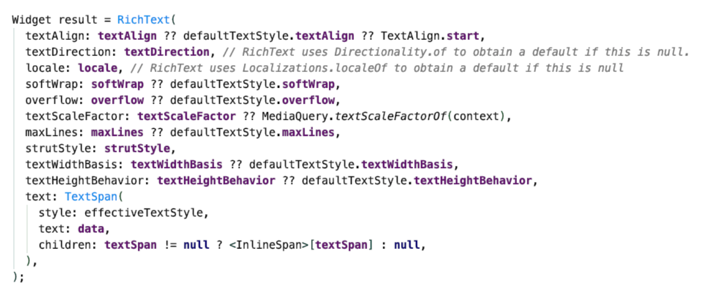

Revisions Flutter

La couche Widget (Widget layer)

L'UI flutter est composée de widgets imbriqués les uns dans les autres. Chaque widget est un élément de l'UI, comme un bouton, un texte, une image, etc. Les widgets sont des objets immuables, ce qui signifie qu'ils ne peuvent pas être modifiés une fois qu'ils ont été créés. Cependant, ils peuvent être remplacés par d'autres widgets. Les widgets sont organisés en une hiérarchie parent-enfant. Le widget parent peut avoir un ou plusieurs enfants. Les widgets enfants peuvent également avoir des enfants, et ainsi de suite. La hiérarchie parent-enfant est appelée widget tree.

Les widgets sont les modeles qui permettent de construire l'UI. Neanmoins ils ne contienent pas la logique qui permet de les afficher. Cette logique est contenue dans la couche Rendering.

Les widgets sont responsables de la production de RenderObjects. Cette etape est tres gourmande en temps et en ressources.



En résumé, les widgets fournissent la configuration et les RenderObjects fournissent la logique d'affichage.

## Les widgets de base et les layouts en Flutter

Pour commencer a creer des layouts en Flutter il faut utiliser les widgets de base. Ces widgets sont les widgets les plus basiques et les plus utilisés. Ils permettent de creer des layouts simples et complexes.

Premiere approche des layouts flutter:

Un layout complex en Flutter est composees de beaucoup de widgets imbriqués qui sont a leur tour transformes en widgets plus simples.

## Les widgets de base

Le widget Text

```dart
 Text(
    'Hello World',
    style: Textstyle(
        fontSize: 20.0,
        color: Colors.blue,
        fontWeight: FontWeight.bold
    )
    )
```

D'autres widgets permettent de reagir a des evenements :

```dart
RaisedButton(
    child: Text('Click me'),
    onPressed: () {
        print('Button clicked');
    }
)
```

## Les layouts en Flutter

Certains widgets permettent d'agir sur la disposition des elements d'UI :

- Center
- Column
- Row

Exemple :

```dart
Center(
    child: Column(
        MainAxisAlignment: MainAxisAlignment.spaceEvenly,
        children: <Widget>[
            Text('Hello World'),
            Text('Hello World'),
            Text('Hello World'),

        ]
    )
)
```


### Le widget Scaffold
Ce widget nous permet de creer une page avec une appbar et un body.

```dart

Scaffold(
    appBar: AppBar(
        title: Text('My App'),
    ),
    body: Center(
        child: Text('Hello World'),
    )
)
```

En general la plupart des ecrans d'applications autront un Scaffold comme parent.

### Le widget ListView

Ce widget permet de creer une liste d'elements.

```dart
ListView.builder(
  itemBuilder: (context, index) {
    return Text("Position $index");
  },
  itemCount: 10,
  scrollDirection: Axis.vertical,
  physics: BouncingScrollPhysics()
),
```

## Comprendre la navigation en Flutter

La navigation en Flutter est tres simple. Il suffit d'utiliser le widget Navigator.
Si vous utilisez une MaterialApp, le Navigator est deja cree pour vous.

Dans la navigation en Flutter, chaque ecran est une route. Il existe deux facon de definir le nom des routes avec le widget MaterialApp :

avec les routes parameter et avec le parametre onGenerateRoute.

Les deux methodes sont identiques. La seule difference est que la methode onGenerateRoute permet de creer des routes dynamiques.

```dart

MaterialApp(
 title: 'Flutter Demo',
 // Accepts a static map
 routes: {
   // Cannot pass arguments in routes
   '/': (context) => DefaultPage(),
   '/page1': (context) => Page1(),
   '/page2': (context) => Page2(),
   '/page3': (context) => Page3(),
    },
 // Can pass parameters
 onGenerateRoute: (settings) {
   final route = settings.name;
   final args = settings.args;
   // Return appropriate page according to route and args
 },
 initialRoute: '/',
 home: const MyHomePage(title: 'Flutter Demo Home Page'),
)
```

Les methodes de navigation :

- Navigator.push() (push page):

```dart
Navigator.push(
  context,
  builder: (context) => NewPage(),
);
```

- Navigation.pop(context) , A chaque fois qu'une page est ajouter a la stack de navigation suite a un push, il est possible de la supprimer de la stack avec la methode pop.

```dart
Navigator.pop(context);
```
